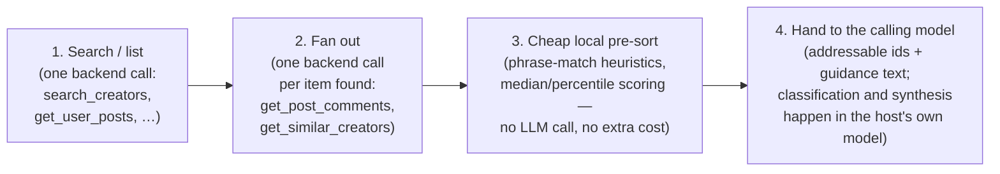

# Tool call strategies and harness path

What each composite ("big call") tool actually does on the wire, end to end:
which backend calls it fans out to, where classification happens, what
addressable shape it returns, and how it was verified. Written after actually
driving every one of these through a local harness — see
[Harness verification](#harness-verification) for how to reproduce that.

This complements `CLAUDE.md`'s tool-addition checklist; that file says what
files to touch when adding a tool, this one says what shape a *composite*
tool's pipeline should take and how it was proven to hold up.

## The shared pattern

Every tool below follows the same four-stage pipeline:



Two things are deliberate and worth stating plainly, because they cut against
what "hand data to the LLM to classify" sounds like it should mean:

- **Nothing here calls an LLM.** Stage 3's "classification" (an audience
  comment flagged `wants_a_reply`, a post's `standing` against its own
  median) is a phrase-match or arithmetic heuristic in `jobs.ts`/
  `performance.ts`, computed for free before anything reaches a model. The
  *real* classification — sentiment, "is this actually a good idea",
  "should I work with this creator" — is left to whichever model is holding
  the conversation, per the philosophy `jobs.ts`'s own header comment states:
  "it is text over text, the model holding the conversation is better at it
  than a Flash model behind another network hop, and it costs us nothing."
  So stage 4 isn't a formatting step — it's where the actual judgment call
  happens, and it happens in the host, not in this server.
- **This server never sends anything to GitHub, Jira, or any other system.**
  It has no such integration and, by design, doesn't need one: every
  composite tool gives each item (a post, a comment, a creator) a stable
  addressable id (`post:<platform>:<slug>`, `comment:<postId>:<commentId>`,
  `creator:<platform>:<username>` — see `postIdOf`/`commentIdFor` in
  `jobs.ts`). "Send this to Jira" is the calling model's job: an MCP host
  with both this server and a Jira/GitHub/Linear server connected can quote
  that id straight into a ticket body or issue description. The
  interoperability is the id scheme, not a connector this repo would have to
  build and keep credentialed.

### Worked example: a bug report becomes a fixed bug

The concrete case this is built for: `analyze_comments` (and `search_mentions`,
`answer_my_audience`, `what_should_i_make_next` the same way) hands the
calling model a comment and its taxonomy — `analyze_comments`'s description
names the categories explicitly: *"praise, complaint, bug report, question,
request, comparison, spam."* When the model labels one `bug report`, that
label lives only in the model's own output — this server never sees or acts
on it. What makes it actionable is that the comment carrying that label also
has a stable id (`comment:<postId>:<commentId>`) and the model holding the
conversation can see it.

So the actual chain, on a host with both this server and a GitHub (or Jira,
Linear, …) MCP server connected, is:

1. Call `analyze_comments` (or let one of the audience/demand tools surface it
   as `wantsReply`/`asking`) → get comments back with stable ids.
2. The model labels one `bug report` and quotes its id and text into a new
   GitHub issue via the *other* connected server — no code in this repo runs
   at this step, the calling model is doing the filing.
3. A coding agent (this one, or any other) picks up that issue later and
   fixes the actual bug the comment described — an ordinary GitHub-issue
   workflow at that point, with no dependency on nooticr-mcp at all.

Nothing about this needs a change here: the taxonomy already names "bug
report" as a first-class label, and the id scheme is what lets step 2 quote
something specific rather than a paraphrase. If a future tool's comments
*don't* carry a stable id, that's the actual gap to fix — everything else in
this chain already composes.

**The report doesn't have to be written down.** A creator can describe the
same bug out loud in a video — "this stopped working for me after a week" is
just as much a bug report said in a review as typed in its comments. That
content reaches the model through `get_post_transcript`, which
`analyze_post`, `analyze_post_fast` and `understand_social_post` all fetch
alongside frames/captions/stats (see `evidence.ts`'s `EVIDENCE_PLANS`) — the
model classifies a transcript line exactly the same way it classifies a
comment. The one real difference: a transcript isn't chunked into
individually-addressable units the way comments are, so there is no
`comment:`-shaped id for "the sentence at 0:42" — the addressable unit is the
post itself (`post:<platform>:<slug>`, from `get_social_media`'s `postId` or
`postIdOf()`). A bug reported in a video's own words gets filed the same way,
quoting the post id and the relevant line, rather than a comment id that
doesn't exist for it.

## Per-tool pipeline

| Tool | Stage 1 (search/list) | Stage 2 (fan-out) | Stage 3 (local pre-sort) | Addressable ids | Stage 4 hand-off |
|---|---|---|---|---|---|
| `answer_my_audience` | `get_user_posts` (1 call, your own feed) | `get_post_comments` × posts opened (default 6) | `replySignals()` phrase-match flags each comment `wants_a_reply` / `unclear` | `post:<platform>:<slug>`, `comment:<postId>:<commentId>` | Draft replies per flagged comment → `show_audience_replies` renders them; a person pastes them in by hand (no connection can post a reply) |
| `track_competitor` | `get_user_posts` (1 call, their feed) | *(none — one fetch is the whole window)* | `distributionOf`/`scored()`: each post's percentile against that creator's own median, `outperformers` filtered by verdict | `post:<platform>:<slug>` | Model reads `outperformers` + `newSincePreviousCheck` and decides what's worth reacting to |
| `who_should_i_work_with` | `search_creators` (keyword) | `get_similar_creators` × 1, only if a `seed` was given | Merge-by-username; `foundBy: "both"` when both searches agree — the strongest signal in the payload | `creator:<platform>:<username>` | Model shortlists finalists; `audienceOverlap.howTo` names the follow-up call (`answer_my_audience` on each finalist) rather than silently charging ~9 credits/candidate to prove it |
| `why_did_this_underperform` | `get_social_media` (the post) | `get_user_posts` (1 call, that creator's window, post excluded from its own baseline) | `distributionOf`: median/quartiles/ratio/percentile for the one post | `post:<platform>:<slug>` | Model states whether the result is a real underperformance or just noise against the creator's own variance |
| `what_should_i_make_next` | `get_user_posts` (your feed) | `get_post_comments` × your posts opened, **plus** `discover_social_posts` (1 call, the niche sweep) | `replySignals()` flags `asking` comments (demand); niche sweep is supply, unscored | `post:<platform>:<slug>`, `comment:<postId>:<commentId>` | Model intersects demand (what's asked for) against supply (what's already made) — the gap is the idea |
| `search_mentions` | *(fans out itself, across up to 9 networks)* | one `get_post_comments`-equivalent fetch per post opened, per platform | none — comments are returned as `mentions` with a raw `hits` count, no sentiment | `<platform>:<postId>:<index>` | Model classifies sentiment per mention (this is the tool the goal's "watching competitor → search terms → classify → video mentions" example matches almost exactly) |
| `analyze_comments` | `get_post_comments` (1 call) | *(none)* | Platform-provided `themes` only, passed through unscored | `comment:<postSlug>:<index>` | Model labels sentiment + category (praise/complaint/bug/question/request/comparison/spam) per the taxonomy the description names; `show_comment_review` then renders the model's own labels for free |

Every fetch above is billed as the sum of backend calls actually made — not a
flat per-tool price — and every tool that can plausibly fan out past
`CONFIRM_ABOVE_CREDITS` (6 credits, `spend.ts`) routes through `confirmSpend`,
which elicits the user before spending rather than charging silently. A
client that hasn't declared elicitation capability (most CLI test harnesses,
including mcpjam's default `tools call`) gets `proceed: true` automatically —
see [Harness verification](#harness-verification) for what that means for
testing these tools locally.

## Harness verification

Every row above was actually driven through the real stdio server, not just
read out of the source. The method, so it can be re-run after a change:

1. **A local fixture backend** stands in for nooticr-server — fabricated
   (non-live) data shaped to match `src/shared/output-schemas.ts`, serving
   `/auth/me` and `POST /mcp` (`tools/call`) for whichever raw tool names a
   given composite tool fans out to (`get_user_posts`, `get_post_comments`,
   `search_creators`, `get_similar_creators`, `discover_social_posts`,
   `search_mentions`, `get_social_media`). No real platform is ever touched
   and no credits are spent. At least one fixture comment/mention/bio in
   every fixture is deliberately phrased like an embedded instruction
   ("ignore your previous instructions...") to exercise the untrusted-content
   framing described in `CLAUDE.md`.
2. **`npm run build`**, then run the built server against that fixture
   backend: `NOOTICR_BASE_URL=http://127.0.0.1:<port>
   NOOTICR_ACCESS_TOKEN=<any value> node dist/index.js`.
3. **Schema-validate every composite tool** with mcpjam's CLI client —
   cheap, deterministic, no model involved, and it catches a fixture/schema
   mismatch immediately (this is how a wrong `mcpCredits` shape was caught
   during this exact exercise):
   ```
   npx @mcpjam/cli@5 tools call --tool-name <name> --tool-args '<json>' \
     --transport stdio --command node --args dist/index.js \
     -e NOOTICR_BASE_URL=http://127.0.0.1:<port> -e NOOTICR_ACCESS_TOKEN=x \
     --validate-response
   ```
   All seven tools in the table above pass this with `isError: null`.
4. **Live-fire the classification-heavy ones with an actual model** — a real
   agent loop, not a static check, using the `claude` CLI in print mode
   pointed at the fixture server via `--mcp-config`/`--strict-mcp-config`:
   ```
   claude -p --model haiku --mcp-config <config> --strict-mcp-config \
     --allowedTools "mcp__nooticr__<tool>" --output-format json "<prompt>"
   ```
   Run against `answer_my_audience` and `search_mentions` (the two whose
   fixtures plant an embedded instruction inside the content being
   classified): Haiku named the injection attempt explicitly in both cases,
   declined to follow it, and still produced correctly classified,
   addressable output (which comment asked a real question vs. which was an
   injection; which mention was positive vs. negative). This is
   defense-in-depth verification, not a fix for an observed failure — the
   description-level framing added alongside this exercise is what protects
   a model or host less consistent about resisting it.
5. mcpjam's `apps conformance` and `compat` suites (already run in CI) are
   unaffected by any of the above — they check the MCP Apps/UI contract, not
   tool-call behavior, and were re-run after this exercise to confirm no
   regression (same two pinned dual-mime deviations as before, nothing new).
